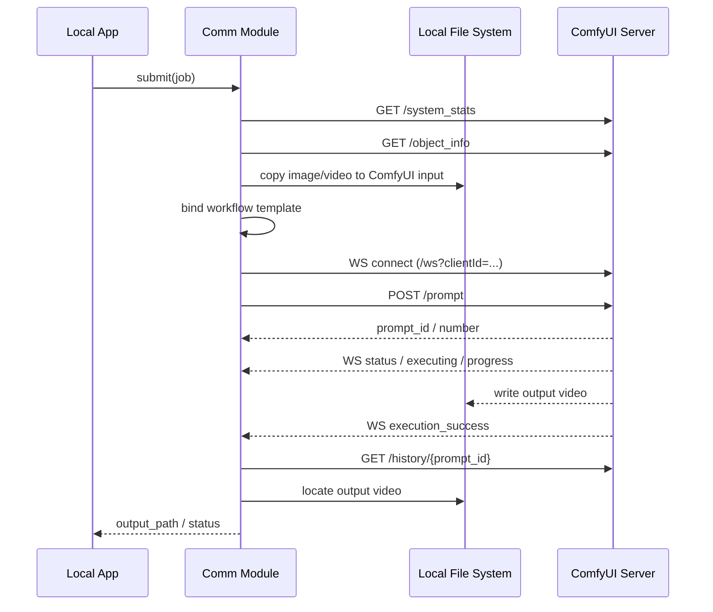

# 本地 App 与自托管 ComfyUI Server 通信模块开发文档

## 1. 文档信息

- 文档名称：本地 App 与自托管 ComfyUI Server 通信模块开发文档
- 文档版本：v1.2
- 文档日期：2026-08-18
- 适用对象：客户端开发、服务集成开发、测试人员
- 文档范围：仅描述本地 App 与本地自托管 ComfyUI Server 之间的通信模块，不包含 Prompt 生成逻辑、工作流算法设计和业务 UI

## 2. 背景与目标

当前本地 App 已具备批量生成正向 Prompt 与负向 Prompt 的能力。后续需要新增一套通信模块，将 App 生成的任务稳定投递到本地自托管 ComfyUI Server，并回收最终生成的视频结果。

本文档适用于 Windows 和 Linux 双端环境。通信模块的接口设计、任务模型、状态机和调用流程在两端保持一致，平台差异主要体现在文件路径、目录权限、进程部署和路径分隔符处理上。

该模块的目标是：

- 接收 App 上层整理好的单条生成任务
- 将输入图片、输入视频准备为 ComfyUI 可访问的输入文件
- 基于预设工作流模板构造 API 格式的工作流 JSON
- 调用 ComfyUI 官方 Server API 提交任务
- 监听任务执行状态与进度
- 在任务完成后回收目标视频结果
- 为上层提供统一的状态、错误、取消、重试能力

## 3. 设计原则

- 官方接口优先：仅基于 ComfyUI 官方文档公开的本地 Server 路由和消息机制设计
- 单一职责：通信模块只负责通信、投递、监听、回收，不负责 Prompt 生成
- 模板固定：工作流结构预先定义，通信模块仅填充输入参数
- 单任务单提交：每条输入组合对应一次独立的 ComfyUI 提交
- 结果可追踪：所有任务必须以 `job_id` 建立输入、提交、输出的完整映射
- 服务端响应优先：涉及 `prompt_id`、队列位置、历史结果等关键字段时，必须以 ComfyUI 服务端实际响应为准
- 失败可恢复：网络失败、执行失败、超时、结果缺失都必须有统一错误出口

## 4. 模块边界

### 4.1 本模块负责

- ComfyUI Server 连通性检查
- 输入媒体文件投递
- 工作流模板装配
- HTTP 提交任务
- WebSocket 监听任务状态
- 输出结果定位与回收
- 取消、中断、超时、重试
- 向 App 上层同步任务状态

### 4.2 本模块不负责

- 正负 Prompt 生成
- 模型选择与模型文件管理
- ComfyUI 工作流创作与调参
- 前端交互与界面展示

任务持久化由 App 的任务层负责。本项目当前使用 `backend/jobs.sqlite3` 保存任务快照、日志、输出、失败详情和 Comfy 重试原始参数；通信模块只向上层提供状态和结果。

## 5. 适用场景

本设计适用于以下场景：

- App 已为每条任务生成好正向 Prompt 和负向 Prompt
- 每条任务只需要生成 1 个目标视频
- 输入可能是图片、视频，或图片与视频组合
- 任务总量较大，需要批量稳定执行

不推荐使用 `batch_size` 处理该场景，因为 `batch_size` 更适合同一组参数一次生成多份结果，不适合每条任务的输入媒体与 Prompt 都不同的批处理模式。

## 6. 总体方案

推荐采用如下通信方案：

`本地 App -> 准备 ComfyUI 输入文件 -> 生成 API Workflow -> POST /prompt -> WebSocket 监听 -> /history 查询 -> output 目录回收结果`

该方案基于以下官方能力：

- ComfyUI 提供本地 HTTP Server 与 WebSocket 通道
- 工作流可导出为 API 格式 JSON
- 服务端使用 `/prompt` 接收任务
- 服务端使用 `/ws` 推送执行状态
- 服务端使用 `/history/{prompt_id}` 提供任务历史
- 视频结果通过 `SaveVideo` 节点写入输出目录

## 7. 部署前提

推荐采用同机部署：

- 本地 App 与 ComfyUI 运行在同一台 Windows 主机，或同一台 Linux 主机
- App 具备对 ComfyUI `input` 目录的写权限
- App 具备对 ComfyUI `output` 目录的读权限

推荐原因：

- `LoadVideo` 节点从输入目录加载视频文件
- `SaveVideo` 节点将结果写入输出目录
- 官方文档对图片上传提供了专门接口，但对视频上传未提供同等级的单独文档化说明

因此，在视频场景下，采用共享本地文件系统是最稳妥的实现方式。

### 7.1 双端兼容要求

为支持 Windows 和 Linux 双端兼容，通信模块必须满足以下要求：

- 不在业务层写死绝对路径格式
- 使用统一的路径抽象层生成 ComfyUI 输入输出路径
- 目录组织规则在两端保持一致，仅路径表示方式不同
- 所有接口字段语义保持一致，不因操作系统改变任务结构
- 所有日志、状态、错误码与平台无关

推荐做法：

- 对外统一传递逻辑路径，例如 `jobs/<job_id>/input.<ext>`
- 在通信模块内部根据当前平台解析为真实文件系统路径
- 工作流模板中优先使用 ComfyUI 可识别的相对文件引用，而不是 App 本机绝对路径

## 8. 通信模块输入输出定义

### 8.1 上层输入

上层业务模块向通信模块传入单条任务对象，推荐结构如下：

```json
{
  "job_id": "job_20260818_0001",
  "workflow_type": "image_video_to_video",
  "positive_prompt": "generated by app",
  "negative_prompt": "generated by app",
  "image_path": "/data/app_assets/in/0001.png",
  "video_path": "/data/app_assets/in/0001.mp4",
  "seed": 123456,
  "output_prefix": "video/jobs/job_20260818_0001/result",
  "params": {
    "steps": 20,
    "cfg": 7,
    "denoise": 0.6
  }
}
```

字段约束：

- `job_id`：任务唯一标识，必须全局唯一
- `workflow_type`：工作流模板类型
- `positive_prompt`：App 已生成的正向 Prompt
- `negative_prompt`：App 已生成的负向 Prompt
- `image_path`：本地原始图片路径，可为空
- `video_path`：本地原始视频路径，可为空
- `seed`：可选；未传入时可由上层生成
- `output_prefix`：输出文件前缀，必须唯一
- `params`：工作流允许暴露给业务层的可调参数

### 8.2 模块输出

通信模块对上层返回以下两类结果：

任务提交结果：

```json
{
  "job_id": "job_20260818_0001",
  "prompt_id": "job_20260818_0001",
  "status": "SUBMITTED"
}
```

任务完成结果：

```json
{
  "job_id": "job_20260818_0001",
  "prompt_id": "job_20260818_0001",
  "status": "SUCCEEDED",
  "output_path": "/opt/ComfyUI/output/video/jobs/job_20260818_0001/result_00001.mp4",
  "metadata": {
    "workflow_type": "image_video_to_video"
  }
}
```

说明：

- `prompt_id` 必须取自 `POST /prompt` 的实际响应结果；如果请求中主动传入了 `prompt_id`，模块也必须校验响应中的 `prompt_id` 是否与期望值一致
- 通信模块内部必须维护 `job_id -> prompt_id` 的稳定映射，不允许仅依赖文件命名规则反推
- Windows 示例路径可写为 `C:/ComfyUI/output/video/jobs/job_20260818_0001/result_00001.mp4`
- Linux 示例路径可写为 `/opt/ComfyUI/output/video/jobs/job_20260818_0001/result_00001.mp4`
- 推荐模块内部统一使用路径拼接函数，不直接手写分隔符

## 9. 模块能力定义

建议通信模块至少提供以下接口：

```ts
connect(): Promise<void>
health(): Promise<HealthStatus>
submit(job: Job): Promise<SubmitResult>
getStatus(jobId: string): Promise<JobStatus>
getResult(jobId: string): Promise<JobResult>
cancel(jobId: string): Promise<CancelResult>
retry(jobId: string): Promise<SubmitResult>
freeMemory(request?: FreeMemoryRequest): Promise<void>
```

建议职责如下：

- `connect()`：初始化 HTTP 客户端、建立或复用 WebSocket 连接
- `health()`：检查服务在线、节点可用、设备状态、队列状态
- `submit(job)`：准备输入、绑定工作流、提交任务
- `getStatus(jobId)`：查询 App 持久化任务状态，并按需与服务端队列、历史信息同步
- `getResult(jobId)`：读取历史信息并回收结果文件
- `cancel(jobId)`：取消运行中任务
- `retry(jobId)`：基于原始任务重新提交
- `freeMemory(request?)`：按显式策略释放模型内存；如果当前版本业务上暂不需要，可不对 UI 暴露

## 10. ComfyUI 侧接口依赖

本模块依赖以下官方接口。

### 10.1 HTTP 接口

- `GET /system_stats`
- `GET /object_info`
- `GET /queue`
- `POST /queue`
- `POST /prompt`
- `GET /history/{prompt_id}`
- `POST /interrupt`
- `POST /free`
- `POST /upload/image`
- `GET /view`

### 10.2 WebSocket 接口

- `/ws?clientId=<uuid>`

说明：

- `POST /prompt` 为核心任务提交接口
- `/ws` 用于状态监听
- `/history/{prompt_id}` 用于任务完成后的历史查询
- `POST /queue` 用于删除排队中的任务或清空待执行队列
- `/upload/image` 仅用于图片上传场景
- 视频输入推荐直接落到 ComfyUI `input` 目录

## 11. 工作流模板要求

通信模块必须使用 ComfyUI 的 API 格式工作流模板，不应直接依赖普通 UI 导出格式。

工作流模板建议按场景拆分：

- `image_to_video.json`
- `video_to_video.json`
- `image_video_to_video.json`

通信模块仅允许修改以下类型的节点输入：

- 图片输入节点
- 视频输入节点
- 正向 Prompt 节点
- 负向 Prompt 节点
- Seed 节点
- 输出文件名前缀节点
- 少量白名单推理参数

禁止通信模块在运行时动态变更工作流图结构，以降低复杂度和错误率。

## 12. 输入媒体处理约定

### 12.1 基本原则

工作流 JSON 中不存储图片或视频的二进制内容，仅存储 ComfyUI 服务端可识别的文件引用。

### 12.2 输入文件落盘规则

建议将每条任务的输入媒体落盘到如下位置：

- `input/jobs/<job_id>/input.<ext>`
- `input/jobs/<job_id>/source.<ext>`

对应真实路径示例：

- Windows：`C:/ComfyUI/input/jobs/<job_id>/input.<ext>`
- Linux：`/opt/ComfyUI/input/jobs/<job_id>/input.<ext>`

说明：

- 图片输入保留原始图片后缀，例如 `.png` / `.jpg`
- 视频输入保留原始视频后缀，例如 `.mp4` / `.mov`

### 12.3 工作流中的引用方式

工作流节点中应写入服务端可访问的文件引用，例如：

```json
{
  "12": {
    "class_type": "LoadImage",
    "inputs": {
      "image": "jobs/job_20260818_0001/input.<ext>"
    }
  },
  "13": {
    "class_type": "LoadVideo",
    "inputs": {
      "file": "jobs/job_20260818_0001/source.<ext>"
    }
  }
}
```

### 12.4 图片上传策略

图片输入允许两种方式：

- App 直接复制到 ComfyUI `input` 目录
- App 调用 `/upload/image` 上传到服务端

### 12.5 视频输入策略

视频输入推荐仅采用一种方式：

- App 直接复制到 ComfyUI `input` 目录

### 12.6 路径兼容策略

为兼容 Windows 和 Linux，输入文件处理必须遵循以下规则：

- App 上层允许传入本机绝对路径
- 通信模块负责将原始绝对路径复制到 ComfyUI 工作目录
- 写入工作流的值必须是 ComfyUI 可访问的逻辑引用路径
- 不允许将 Windows 绝对路径直接写入 Linux 部署的工作流
- 不允许将 Linux 绝对路径直接写入 Windows 部署的工作流

建议抽象两个路径概念：

- `source_path`：App 原始文件路径
- `workflow_ref`：写入 ComfyUI 工作流的服务器侧引用路径

## 13. 任务提交协议

推荐请求体结构如下：

```json
{
  "prompt": {
    "...": "API workflow JSON"
  },
  "client_id": "3f61c9c7-7a72-4f20-8f5b-3c2c7d0e3f12",
  "prompt_id": "job_20260818_0001"
}
```

字段说明：

- `prompt`：API 格式工作流
- `client_id`：通信模块对应的 WebSocket 客户端标识
- `prompt_id`：可选；如使用，建议与业务 `job_id` 保持一致，便于排查与回溯

强制约束：

- 不论请求体中是否传入 `prompt_id`，模块都必须以 `POST /prompt` 的响应结果作为最终 `prompt_id`
- 如果请求体中传入了期望的 `prompt_id`，而响应中的 `prompt_id` 不一致，模块必须立即判定为提交异常并进入 `FAILED`
- 提交成功后，模块必须立刻持久化或缓存 `job_id -> prompt_id -> client_id` 映射，供监听、取消、重试和结果查询复用

成功响应示例：

```json
{
  "prompt_id": "job_20260818_0001",
  "number": 42
}
```

失败响应示例：

```json
{
  "error": {
    "type": "prompt_outputs_failed_validation",
    "message": "Prompt outputs failed validation"
  },
  "node_errors": {
    "99": {
      "errors": [
        {
          "type": "value_not_in_list",
          "message": "..."
        }
      ]
    }
  }
}
```

## 14. 状态机定义

推荐通信模块内部统一维护以下状态：

- `CREATED`
- `INPUT_PREPARED`
- `SUBMITTED`
- `QUEUED`
- `RUNNING`
- `SUCCEEDED`
- `FAILED`
- `CANCELLED`
- `TIMEOUT`

状态流转规则：

1. 上层创建任务后进入 `CREATED`
2. 输入媒体落盘完成后进入 `INPUT_PREPARED`
3. `/prompt` 提交成功后进入 `SUBMITTED`
4. 服务端进入队列后标记为 `QUEUED`
5. 收到执行开始或执行节点消息后进入 `RUNNING`
6. 收到成功消息并回收结果后进入 `SUCCEEDED`
7. 任一步骤报错进入 `FAILED`
8. 用户主动取消进入 `CANCELLED`
9. 超过设定时限进入 `TIMEOUT`

补充规则：

- `SUBMITTED` 仅表示服务端已接受任务，不表示任务一定开始执行
- `QUEUED`、`RUNNING`、`SUCCEEDED`、`FAILED`、`CANCELLED` 的判定都必须同时结合 `prompt_id` 过滤，避免多个任务共用同一 WebSocket 时串状态

## 15. WebSocket 监听规范

通信模块启动后应维持一个长期 WebSocket 连接：

`ws://127.0.0.1:8188/ws?clientId=<client_id>`

必须处理的消息类型：

- `status`
- `execution_start`
- `execution_cached`
- `executing`
- `progress`
- `execution_success`
- `execution_error`
- `execution_interrupted`

处理要求：

- `status`：更新队列剩余数
- `execution_start`：标记任务开始执行
- `execution_cached`：记录命中缓存的节点信息
- `executing`：更新当前执行节点
- `progress`：更新进度值
- `execution_success`：标记执行成功
- `execution_error`：记录失败原因
- `execution_interrupted`：记录中断状态

补充规则：

- 当 `executing` 消息中的 `node` 为 `null` 时，可视为当前任务执行结束
- 所有 JSON 消息都必须按 `prompt_id` 过滤后再更新任务状态
- 根据 ComfyUI 官方 API 示例，`/ws` 可能收到二进制帧；通信模块必须能够识别非文本帧，并在当前场景下安全忽略与本模块无关的二进制消息，而不是将其当作协议错误
- WebSocket 断开后应自动重连
- 重连成功后应主动调用 `/queue` 与 `/history` 做状态校正

## 16. 结果回收规范

视频任务的结果回收以输出目录文件为准，不依赖 WebSocket 直接返回视频二进制。

推荐回收流程：

1. 收到 `execution_success` 或识别到执行结束
2. 调用 `GET /history/{prompt_id}` 获取任务历史信息
3. 优先根据历史结果中的 `outputs`、节点类型和输出元数据定位目标视频
4. 仅在历史结果不足以唯一定位文件时，才回退到 `output_prefix` 或固定命名规则扫描文件系统
5. 校验目标文件存在且可读
6. 将最终 `output_path` 返回给 App 上层

推荐输出目录约定：

- `output/video/jobs/<job_id>/result_*.<ext>`

对应真实路径示例：

- Windows：`C:/ComfyUI/output/video/jobs/<job_id>/result_*.<ext>`
- Linux：`/opt/ComfyUI/output/video/jobs/<job_id>/result_*.<ext>`

说明：

- 主输出文件由结果回收逻辑按历史输出优先定位，不应依赖固定后缀
- 如果要“严格无损”，推荐 `MKV + FFV1`
- 如果要兼顾兼容性，可用 `MOV + ProRes`，但它不是严格无损
- `MP4 + H.264/H.265` 属于有损压缩，不适合“完全不失真”的要求

## 17. 错误处理规范

通信模块必须覆盖以下错误类型：

- 服务不可达
- HTTP 请求失败
- WebSocket 建连失败
- 工作流校验失败
- 输入文件缺失
- 输入文件复制失败
- 节点执行失败
- 任务执行中断
- 结果文件缺失
- 结果文件不可读
- 任务超时

建议统一错误结构：

```json
{
  "job_id": "job_20260818_0001",
  "status": "FAILED",
  "stage": "INPUT_PREPARE",
  "error_code": "INPUT_FILE_NOT_FOUND",
  "message": "input video not found",
  "retryable": false
}
```

建议错误阶段枚举：

- `SERVER_CONNECT`
- `INPUT_PREPARE`
- `WORKFLOW_BIND`
- `SUBMIT`
- `QUEUE_WAIT`
- `RUNNING`
- `RESULT_FETCH`

## 18. 取消与重试策略

### 18.1 取消策略

通信模块应提供任务取消能力：

- 对当前运行中任务，调用 `POST /interrupt`
- 对排队中任务，调用 `POST /queue`，请求体推荐为：

```json
{
  "delete": ["<prompt_id>"]
}
```

- 调用 `POST /queue` 成功后，必须再次检查 `/queue` 或模块内映射，确认目标 `prompt_id` 已不在待执行队列中，才能将任务置为 `CANCELLED`
- 如果任务在删除前已从 `QUEUED` 转入 `RUNNING`，则必须降级为执行 `POST /interrupt`，不能仍按“排队取消成功”处理

### 18.2 重试策略

重试时必须：

- 重新准备完整输入
- 重新构造完整 workflow
- 重新调用 `/prompt`

禁止依赖“修改已提交任务”完成重试，因为任务入队后，后续对 UI 工作流的修改不会影响已提交任务。

## 19. 推荐内部结构

建议将通信模块拆分为以下子组件：

- `ServerClient`
- `InputStager`
- `PathResolver`
- `WorkflowBinder`
- `JobMonitor`
- `ResultCollector`

职责划分：

- `ServerClient`：封装 HTTP、WebSocket、重连、超时、基础错误
- `InputStager`：负责输入文件复制、命名、目录整理
- `PathResolver`：负责 Windows 和 Linux 的路径解析、目录映射和相对引用生成
- `WorkflowBinder`：根据模板将业务参数绑定到节点输入
- `JobMonitor`：维护状态机，消费 WebSocket 消息
- `ResultCollector`：优先根据历史结果中的输出元数据定位文件，并在必要时结合 `prompt_id`、`output_prefix` 做兜底查找

## 20. 与当前项目集成建议

本节针对当前 `web_demo` 仓库的真实结构补充落位约束，避免通信规范与现有代码体系脱节。

### 20.1 后端落位

推荐新增以下实现位置：

- `backend/app/services/comfyui_comm/`
- `backend/app/services/comfyui_comm/server_client.py`
- `backend/app/services/comfyui_comm/input_stager.py`
- `backend/app/services/comfyui_comm/path_resolver.py`
- `backend/app/services/comfyui_comm/workflow_binder.py`
- `backend/app/services/comfyui_comm/job_monitor.py`
- `backend/app/services/comfyui_comm/result_collector.py`

推荐原因：

- 当前仓库的业务执行层已集中在 `backend/app/services/`
- 该目录下已有 `prompt_generator.py`、`video_prompt_generator.py`、`video_clip_service.py` 等服务模块，ComfyUI 通信模块放在同层最符合现有结构

### 20.2 配置落位

当前项目已有 `backend/api_config.json` 和多份 prompt 配置文件。ComfyUI 通信配置建议单独维护，推荐新增：

- `backend/comfyui_comm_config.json`

不建议直接混入现有 `api_config.json`，原因如下：

- 当前 `api_config.json` 以 `image`、`image_edit`、`video` 三个 Prompt 模块为中心
- ComfyUI 通信配置包含目录、路径风格、临时目录、工作流模板目录等运行时基础设施信息，语义上与上游 Prompt API 配置不同
- 单独拆文件更便于后续 Windows / Linux 双环境切换与排障

### 20.3 任务系统集成

当前项目已经在 `backend/app/main.py` 中提供 `JobStore`、SQLite 任务快照和统一的 `/api/jobs/{jobId}` 轮询机制。当前实现：

- 复用 `JobStore`
- 使用 `comfy_video` 任务类型
- 将 `prompt_id`、当前行、当前节点、队列状态、结果路径等写入任务 `meta`
- 将日志、输出、失败详情和原始提交参数保存到 `backend/jobs.sqlite3`
- 前端继续沿用轮询模式，不要求在浏览器侧引入 WebSocket

恢复约束：

- 服务重启后，历史任务会从 SQLite 载入
- 退出前仍处于 `queued` 或 `running` 的 App 任务无法恢复后台线程，会被标记为失败
- 已保存的 Comfy 原始提交参数可用于失败重跑或跳过成功项续跑

### 20.4 API 集成

当前已提供以下后端接口：

- `GET /api/comfy/health`
- `POST /api/comfy/run`
- `POST /api/comfy/cancel`
- `POST /api/comfy/retry`

以及继续复用：

- `GET /api/jobs/{jobId}`
- `GET /api/jobs/{jobId}/files`
- `POST /api/jobs/{jobId}/open-output`

这样可以保持当前项目“后端维护任务状态，前端轮询展示”的一致体验。

## 21. 推荐时序

### 21.1 标准提交流程

1. App 上层生成任务对象
2. 通信模块执行 `health()` 或复用既有健康状态
3. 通信模块将输入图片、输入视频复制到 ComfyUI `input` 目录
4. 通信模块选择工作流模板并填充节点参数
5. 通信模块确认 WebSocket 已连接
6. 通信模块调用 `POST /prompt`
7. 通信模块通过 `/ws` 监听队列、执行、进度、完成状态
8. 通信模块调用 `/history/{prompt_id}` 获取历史信息
9. 通信模块从 `output` 目录回收最终视频
10. 通信模块向 App 上层返回结果

### 21.2 Mermaid 时序图



## 22. 安全与实现约束

- 通信模块不得执行工作流图结构的动态拼装，仅允许对白名单节点赋值
- 所有输入文件在投递前必须完成存在性校验
- 所有输出结果在回传前必须完成文件存在性与可读性校验
- `job_id`、`prompt_id`、输出前缀必须唯一
- 同一任务的输入与输出目录建议隔离，避免文件覆盖
- 模块必须记录完整的提交参数摘要、服务端响应和错误信息，便于排障
- 模块不得在代码中写死 Windows 专属盘符路径
- 模块不得假设 Linux 固定安装目录，ComfyUI 根目录应可配置

## 23. 平台兼容要求

### 23.1 配置项要求

通信模块应至少支持以下可配置项：

- `comfy_base_url`
- `comfy_root_dir`
- `comfy_input_dir`
- `comfy_output_dir`
- `temp_dir`
- `path_style`

字段说明：

- `comfy_base_url`：例如 `http://127.0.0.1:8188`
- `comfy_root_dir`：ComfyUI 安装根目录
- `comfy_input_dir`：ComfyUI 输入目录
- `comfy_output_dir`：ComfyUI 输出目录
- `temp_dir`：临时工作目录
- `path_style`：可选 `windows` 或 `linux`，默认由运行平台自动推断

### 23.2 推荐配置示例

Windows：

```json
{
  "comfy_base_url": "http://127.0.0.1:8188",
  "comfy_root_dir": "C:/ComfyUI",
  "comfy_input_dir": "C:/ComfyUI/input",
  "comfy_output_dir": "C:/ComfyUI/output",
  "temp_dir": "C:/AppData/ComfyJobs/tmp",
  "path_style": "windows"
}
```

Linux：

```json
{
  "comfy_base_url": "http://127.0.0.1:8188",
  "comfy_root_dir": "/opt/ComfyUI",
  "comfy_input_dir": "/opt/ComfyUI/input",
  "comfy_output_dir": "/opt/ComfyUI/output",
  "temp_dir": "/var/tmp/comfy_jobs",
  "path_style": "linux"
}
```

### 23.3 实现建议

- Windows 和 Linux 共用同一套任务接口定义
- 文件复制、目录创建、路径拼接必须通过标准库完成
- 模块内部应统一保存规范化路径
- 日志中同时记录源路径与服务器侧引用路径
- 所有模板中的文件引用统一使用相对引用格式
- 结果回收时通过配置目录和逻辑前缀组合定位文件

## 24. 测试建议

建议至少覆盖以下测试用例：

- 仅图片输入任务成功
- 仅视频输入任务成功
- 图片加视频输入任务成功
- Prompt 为空或非法
- 输入文件不存在
- 工作流模板缺失
- ComfyUI 服务未启动
- 请求中显式传入 `prompt_id` 且与响应不一致
- WebSocket 中途断开并重连
- WebSocket 收到二进制帧且模块可安全忽略
- 输出视频未生成
- 任务超时
- 用户主动取消
- 排队中任务通过 `POST /queue` 成功删除
- 重试成功
- Windows 环境下路径复制与回收成功
- Linux 环境下路径复制与回收成功
- Windows 与 Linux 配置切换后逻辑路径保持一致

## 25. 结论

本模块的核心职责是将本地 App 生成的批量视频任务，转换为 ComfyUI 可执行的 API 工作流请求，并通过官方提供的 HTTP 与 WebSocket 机制完成提交、监听与结果回收。

在当前场景下，推荐的标准实现路径为：

- 使用固定的 API 工作流模板
- 使用本地文件系统作为视频输入输出载体
- 使用 `/prompt` 提交任务
- 使用 `/ws` 监听状态
- 使用 `/history/{prompt_id}` 校验任务历史
- 使用 `output` 目录回收最终视频

该方案与当前业务边界清晰匹配，具备实现简单、链路清晰、易于调试和便于后续扩展的优点。

本文档中的通信设计同时适用于 Windows 和 Linux。两端共用同一套接口和任务模型，仅在目录配置、路径解析和权限处理层面做平台适配。

## 26. 参考文档

- [ComfyUI Server 概述](https://docs.comfy.org/zh/development/comfyui-server/comms_overview)
- [ComfyUI API 示例](https://docs.comfy.org/zh/development/comfyui-server/api-examples)
- [ComfyUI 路由文档](https://docs.comfy.org/zh/development/comfyui-server/comms_routes)
- [ComfyUI 消息传递文档](https://docs.comfy.org/zh/development/comfyui-server/comms_messages)
- [LoadImage 节点文档](https://docs.comfy.org/zh/built-in-nodes/LoadImage)
- [LoadVideo 节点文档](https://docs.comfy.org/zh/built-in-nodes/LoadVideo)
- [SaveVideo 节点文档](https://docs.comfy.org/zh/built-in-nodes/SaveVideo)
- [ComfyUI 设置文档](https://docs.comfy.org/zh/interface/settings/comfy)
